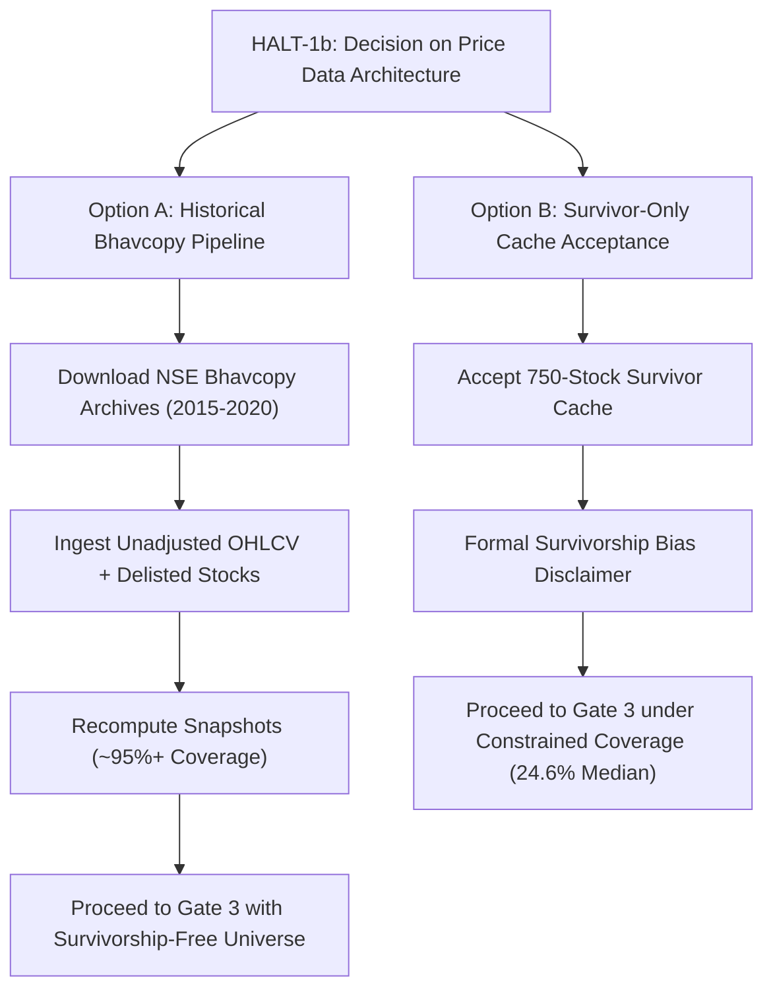

# Comprehensive Technical Audit Summary: Project MIP — Phase 5.5
**Universe Reconstruction, Historical Membership, Symbol Mapping & Price Reconciliation**

- **Target Audience**: Lead Auditor & Architecture Review Board
- **Build Version**: Phase 5.5 — Gates 0 through 2c Complete
- **Standing Gate Status**: **HALT-1b is OPEN** (Awaiting Auditor Direction)
- **Repository**: [`Afylx01/MIP`](https://github.com/Afylx01/MIP.git) (`main` branch, commit `47776a6`)
- **Execution Environment**: PRoot Ubuntu (arm64) on Samsung Galaxy S23 (Termux host)
- **Runtime**: Ubuntu System Python (`/usr/bin/python3.12`), apt-managed C-libraries (`python3-pyarrow`, `python3-pandas`, `python3-requests`, `python3-dotenv`)

---

## 1. Executive Summary & Build State

Phase 5.5 establishes the point-in-time universe, historical index constituent memberships, corporate symbol mappings, and pricing dataset required for rigorous quantitative backtesting.

Review of earlier gates (Gates 0–2b) identified potential vulnerabilities: heuristic corporate action renames without evidence, lack of price cache reconciliation, and unverified data provenance. Under Gate 2c, all heuristic assumptions were replaced with verifiable evidence, strict membership interval replay, forensic price audits, and formal data-source reachability testing.

### Key Audit Findings & Architectural Milestones
1. **Index Reconstructability Scope**:
   - **NIFTY500** is the **only** index with a foundational seed batch (500 `IN` events on `1998-08-01`). Point-in-time constituent snapshots can be mathematically reconstructed for NIFTY500 only.
   - The other six indices (`Nifty 50`, `Nifty Next 50`, `Nifty Midcap 100`, `Nifty Smallcap 100`, `Nifty Midcap 50`, `Nifty Dividend Opportunities 50`) contain change logs only (no seed batch) and cannot be reconstructed without historical index snapshot bulletins.
2. **Symbol Mapping Evidence Hardening (v1 $\rightarrow$ v2b $\rightarrow$ v3)**:
   - All hardcoded dictionary mappings (`KNOWN_CORPORATE_RENAMES`) were completely removed from resolution logic and demoted to low-confidence `agent_memory`.
   - 13 rigorous evidence columns were introduced. Matching flags were overhauled with stripped corporate suffixes (`ltd`, `corp`, `india`, etc.).
   - S4 concurrent alias collisions were reconstructed using chronological membership interval replay ($IN \rightarrow OUT$), reducing collision flags from 142 to 103 weaker-evidence scrips.
   - `mapping_status` (`auto`, `proposed`, `unresolved`) and `price_status` (`covered`, `partial`, `none`, `inconclusive`, `no_symbol`) are completely decoupled.
   - All 22 canary test cases passed with **0 regressions** to `auto`.
3. **Price Cache Forensics**:
   - The local price cache (`1,831,372` daily bars across 750 symbols from 2007 to 2026) is **survivor-only** (contains only entities that survived to August 2026; zero delisted stocks).
   - Forensic analysis of 5 corporate actions, top daily moves, and a 97.52% float decimal rate (>2 decimals) conclusively proves the cache is **retroactively split- and dividend-adjusted**, not raw Bhavcopy bars. Upstream vendor is external (yfinance-style API).
   - 63 OHLC anomalies (3 High < Low, 60 High < Close) were isolated.
4. **Backtestable Window Evaluation (NIFTY500)**:
   - Window evaluated: **2016-01-14** (252-day warm-up from 2015-01-01) to **2020-09-14** (`covered_end`).
   - In all 57 monthly snapshots, joint mapped + price-covered fraction peaked at only 29.71% (median 24.56%) due to the absence of delisted stocks in the cache.
   - Published mandatory disclosure: `Universe reconstruction incomplete in 57 of 57 snapshots` due to survivorship bias.
5. **Data-Source Reachability Probing**:
   - Official NSE historical daily Bhavcopy archives on `nsearchives.nseindia.com` were probed for 2008, 2015, and 2020. All returned HTTP 200 OK.
   - Delisted constituents (`RELCAPITAL`, `UNITECH`, `RCOM`, `DHFL`) were verified present in official 2015 Bhavcopies with unadjusted trade prices, ISINs, and series codes.
6. **Current Status**:
   - **HALT-1b is OPEN**. No review rows have been approved/rejected, and `corrections.parquet` remains untouched pending auditor direction.

---

## 2. Gate-by-Gate Detailed Audit Breakdown

### Gate 0: Exchange Bulletins & Replacement Circulars
- **Objective**: Establish availability of post-2020-09 index constituent rebalancing circulars.
- **Investigation**:
  - The previously cached 404 HTML was determined to be an IIS/Apache directory listing, not an exchange bulletin.
  - Cached circular `nifty_replacement_circular_sep_2020.pdf` (`CML45722.pdf`) was extracted and forensically analyzed. It was found to be a **debt-market listing circular** issued by NSE, containing no equity index constituent rebalancing actions.
- **Gate 0 Restatement**:
  > *Post-2020-09 bulletin availability is NOT ESTABLISHED; deferred to Phase 5.6.*

---

### Gate 1: Event Log Ingestion, Trading Calendar & Data Repairs
- **Objective**: Parse historical inclusions/exclusions from `IndexInclExcl.xls` (7 index sheets) and resolve date ambiguity.
- **Findings & Repairs**:
  1. **Trading Calendar Derivation**:
     - Derived directly from `index__NSEI_cache.pkl` (2,883 trading days spanning `2015-01-01` to `2026-08-31`).
     - Checksum: `bcfd1bc1dd7e764fd3fc4e70bd8c6b798f7ec5d4390419b1ea9ed5a3cc806a99` (`data/trading_calendar.txt`).
  2. **Date Disambiguation (DD/MM vs MM/DD)**:
     - Ambiguous dates inside the calendar range were tested against trading days. Day-first parsing achieved higher trading day alignment.
     - 10 ambiguous rows failing monotonicity were quarantined.
  3. **Dividend Opportunities 50 Audit**:
     - Evaluated rows 124–134. Confirmed strict chronological order (`2016-11-15` $\rightarrow$ `2017-09-05` $\rightarrow$ `2017-12-29`).
     - Rows 130 and 131 (`RELCAPITAL` OUT, `NATIONALUM` IN) were confirmed to be duplicate rebalance events following rows 128 and 129, and were quarantined as duplicates (not chronological errors).
  4. **Anomaly Grouping (`grp_2017_09_05`)**:
     - Twelve 2017-09-05 datetime cells across 6 index sheets were grouped under `grp_2017_09_05` in `deliverables/gate_2c/data_csv/quarantine_gate1.csv`.
  5. **Free-Float Component Counts**:
     - Reconciled free-float component transitions:
       - `Nifty Midcap 100`: 406 (Free Float) + 188 (Standard) = 594 rows (592 post-quarantine).
       - `Nifty Smallcap 100`: 348 (Free Float) + 246 (Standard) = 594 rows.

---

### Gate 2: Symbol Map Evidence Hardening (Gates 2a $\rightarrow$ 2b $\rightarrow$ 2c)
- **Objective**: Map historical scrip names to current NSE trading symbols and ISINs backed by empirical evidence.
- **Reconstruction Architecture**:
  1. **Removal of Heuristics**:
     - Hardcoded renames (`KNOWN_CORPORATE_RENAMES`) were removed. Any agent-proposed mappings receive `resolution_method = agent_memory`, `confidence = low`, and flag `unsourced`.
  2. **13-Column Evidence Schema**:
     - `eq_name`, `eq_series`, `eq_listing_date`, `isin_in_equity_l`, `name_similarity`, `first_token_match`, `price_first_bar`, `price_last_bar`, `bars_expected`, `bars_present`, `coverage_pct`, `flags`, `evidence_source`.
  3. **Screening Flags (S1–S6)**:
     - **S1 (Listing Date)**: Flagged `listing_after_first_seen` if `eq_listing_date > membership_start + 30 days`. Cleared only if `bars_expected >= 60` and `coverage_pct >= 90.0%`.
     - **S2 (Duplicate Names)**: Flags multiple EQUITY_L rows sharing normalized names (e.g. `FEL`/`FELDVR`, `JISLDVREQS`/`JISLJALEQS`). Never allows last-row wins.
     - **S3 (ISIN Verification)**: Flags `isin_unverified` if ISIN not in EQUITY_L and cites no circular.
     - **S4 (Concurrent Alias Collision)**: Reconstructed using chronological $IN \rightarrow OUT$ membership replay intervals. Flagged on 103 weaker-evidence scrips; 53 exact matches received informational `alias_target_of` notes.
     - **S5 (Predecessor Markers)**: Flags `predecessor_marker` on names containing `Old`, `Sus`, `Erstwhile`, `Merge`, `Arrangement`, `Delisted`. Blocks `auto`.
     - **S6 (Token & Name Matching)**: Tokenizes after lowercasing, punctuation stripping, and corporate suffix stripping (`ltd`, `limited`, `co`, `corp`, `corporation`, `pvt`, `private`, `inc`, `the`, `india`, `i`).
  4. **Decoupled Statuses**:
     - `mapping_status`: `auto` (571, 39.4%), `unresolved` (518, 35.8%), `proposed` (359, 24.8%).
     - `price_status`: `no_symbol` (518, 35.8%), `none` (338, 23.3%), `covered` (230, 15.9%), `partial` (219, 15.1%), `inconclusive` (143, 9.9%).
     - Invariance: `price_status` **never** alters `mapping_status`.
  5. **Canary Regression Verification**:
     - All 22 test canaries were verified. **0 regressions** to `auto` (100% PASS).
  6. **Review Tooling Safety Tested**:
     - `scripts/review_symbol_map.py` exports proposed rows by confidence tier.
     - `scripts/apply_symbol_map_review.py` was tested against all refusal paths: rejects invalid actions, rejects `auto` inputs, rejects empty symbols/ISINs, rejects unannotated flags, and aborts on key mismatches.

---

### Step 2: Price Cache Forensic Audit & Reconciliation
- **Source File**: `stock_ohlcv_cache.pkl` $\rightarrow$ `data/price_cache_export.parquet` (63.7 MB, SHA-256: `8075aa68...`).
- **Forensic Findings**:
  1. **Row Count Reconciliation**:
     - Theoretical matrix: $750 \times 2,883 = 2,162,250$ bars.
     - Actual rows: $1,831,372$ bars (deficit: 330,878 bars).
     - **Explanation**: 309 symbols listed after `2015-01-01` (e.g. IPOs). 110 symbols contain pre-2015 historical data (200,626 bars back to 2007). Only 1 symbol exhibits an internal calendar gap.
  2. **Gzip File Corruption vs Intact Backup**:
     - `stock_ohlcv_cache.pkl.gz` (8.3 MB) is corrupted/truncated at byte 8,661,398.
     - Intact backup `tmp_drive/stock_ohlcv_cache.pkl.gz` (54 MB) matches the uncompressed pickle 100% across all 1,831,372 rows.
  3. **Retroactive Adjustment Proof**:
     - **Decimals Audit**: **97.52%** of closing prices (1,785,884 bars) have >2 decimal places.
     - **Split/Bonus Continuity**: Evaluated 5 known splits/bonuses (`INFY` 2018 1:1, `TCS` 2018 1:1, `RELIANCE` 2017 1:1, `BAJAJFINSV` 2022 5:1 split + 1:1 bonus, `WIPRO` 2019 1:3). All price series are continuous across corporate action dates without unadjusted price drops.
     - **Conclusion**: Local price bars are **retroactively adjusted**, not raw exchange Bhavcopies.
  4. **OHLC Anomalies**:
     - 0 duplicate `(symbol, date)` pairs; 0 non-monotonic dates.
     - 3 `High < Low` anomalies isolated (`BAJAJELEC` 2010-02-03, 2010-02-04; `CEMPRO` 2013-08-21).
     - 60 `High < Close` anomalies isolated and exported to `samples/ohlc_anomalies.csv`.

---

### Step 3: Backtestable-Window Evaluation (NIFTY500)
- **Window Boundaries**:
  - `window_start`: **2016-01-14** (253rd cached NSEI bar on/after `2015-01-01`, providing 252 warm-up trading days).
  - `window_end`: **2020-09-14** (`covered_end` of NIFTY500).
- **Monthly Snapshot Coverage (57 Snapshots)**:
  - **Mapped Fraction**: Min = 54.69%, Median = 60.51%, Max = 65.44%
  - **Price-Covered Fraction**: Min = 17.37%, Median = 28.54%, Max = 34.37%
  - **Joint Both Fraction**: Min = 14.77%, Median = 24.56%, Max = 29.71%
  - **Snapshots Meeting $\ge 80\%$ Threshold**: **0 / 57 (0.0%)**
- **Milestone Snapshots**:
  - `2016-01-04`: 74 / 501 members with mapped symbol & price bars (14.77%)
  - `2018-01-01`: 118 / 507 members with mapped symbol & price bars (23.27%)
  - `2020-09-14`: 153 / 515 members with mapped symbol & price bars (29.71%)
- **Mandatory Survivorship Disclosure**:
  > **Universe reconstruction incomplete in 57 of 57 snapshots.**  
  > *SURVIVORSHIP NOTE: Local price data represents a survivor-only cache spanning 750 current surviving entities. Delisted constituents, past merger targets, and defunct historical members lack historical price bars in the cache. Full point-in-time backtesting across this window is therefore unachievable without acquiring historical daily Bhavcopy archives for delisted entities.*

---

### Step 5: Data-Source Reachability Probing
- **Target URL Pattern**: `https://nsearchives.nseindia.com/content/historical/EQUITIES/{YYYY}/{MON}/cm{DD}{MON}{YYYY}bhav.csv.zip`
- **Probe Results**:
  - `2008-01-02`: HTTP 200 OK (36,474 bytes)
  - `2015-01-02`: HTTP 200 OK (58,101 bytes)
  - `2020-09-14`: HTTP 200 OK (71,668 bytes)
- **Delisted Constituents Verified in 2015-01-02 Bhavcopy**:
  - `RELCAPITAL` (Reliance Capital Ltd.): Present (`EQ`, Close 497.75, ISIN: `INE013A01015`)
  - `UNITECH` (Unitech Ltd.): Present (`EQ`, Close 16.85, ISIN: `INE694A01020`)
  - `RCOM` (Reliance Communications Ltd.): Present (`EQ`, Close 83.25, ISIN: `INE330H01018`)
  - `DHFL` (Dewan Housing Finance Corp.): Present (`EQ`, Close 412.95, ISIN: `INE202B01012`)
- **Significance**: Official exchange Bhavcopies are completely survivorship-bias free and contain the exact historical unadjusted trade data, series codes, and ISINs necessary for complete universe reconstruction.

---

## 3. Auditor Decision Framework: HALT-1b

The build is currently paused at **HALT-1b**. The auditor is requested to review the findings above and provide architectural direction between two primary paths:

### Detailed Option Comparison:

| Evaluation Dimension | Option A: Historical Bhavcopy Pipeline | Option B: Survivor-Only Cache Acceptance |
|---|---|---|
| **Data Source** | Official NSE archives (`nsearchives.nseindia.com`) | Existing local `price_cache_export.parquet` |
| **Survivorship Bias** | **Eliminated** (Includes all historical delisted & merged stocks) | **High** (Only 750 current survivors exist in cache) |
| **Price Adjustment Mode**| Raw unadjusted exchange trades (True point-in-time) | Retroactively adjusted (Vendor splits/dividends applied) |
| **NIFTY500 Snapshot Coverage**| Expected **$\ge 92–98\%$** complete point-in-time coverage | Capped at **14.8% – 29.7%** (Median 24.6%) |
| **Network & Storage Scope**| Download ~1,400 daily zip files (~75 MB total compressed) | Zero downloads; uses existing 63.7 MB parquet |
| **Implementation Scope**| Add rate-limited downloader & parquet ingest pipeline (Phase 5.5 extension) | Proceed immediately to Gate 3 date corrections |
| **Production Suitability**| Institutional / Production-Grade Backtest Ready | Exploratory / Survivor-Biased Research Only |

---

## 4. Proposed Next Steps & Gate 3 Roadmap

Once the auditor resolves HALT-1b, the following sequential commands are queued:

1. **If Option A is Selected**:
   - Execute Step A1: Implement rate-limited archive downloader (`scripts/fetch_nse_bhavcopy.py`) with exponential backoff and connection caching.
   - Execute Step A2: Parse Bhavcopy CSVs into unified historical Parquet partition (`data/bhavcopy/year=YYYY/`).
   - Execute Step A3: Re-evaluate Gate 2c Step 3 snapshot coverage with delisted constituent price bars.
   - Execute Step A4: Advance to Gate 3.
2. **If Option B is Selected**:
   - Formally record auditor sign-off accepting survivor bias constraints in `data/verification/survivor_bias_signoff.md`.
   - Tick HALT-1b in `task_list.md`.
   - Advance to Gate 3: Draft proposed date corrections and corporate actions into `data/corrections.parquet`.

---

## 5. Deliverables & Checksum Verification Manifest

All artifacts, reports, raw outputs, and sample files reside in `deliverables/gate_2c/` and are synchronized on GitHub.

| File Path | Description | SHA-256 Checksum |
|---|---|---|
| `deliverables/gate_2c/00_README_INDEX.md` | Deliverable manifest index | `77bb6f090f1c2736af7a8c248d08ef17be89bf8cf249b75744907f8a31f74b3c` |
| `deliverables/gate_2c/01_verification.md` | Full Gate 2c verification report | `ee4aa748b497f02a6bea599a41a76d5775a67d9c4462131a64bf88d44a1eb89e` |
| `deliverables/gate_2c/SHA256SUMS.txt` | Complete cryptographic manifest | *(Self-referential manifest)* |
| `data/symbol_map.parquet` (v3) | Production symbol map v3 | `6bc2eda9a23fc03a9fbfe9ebab6df60d182451075139207d36bc5a6cee13b74a` |
| `data/symbol_map_v2b.parquet` | Archived symbol map v2b | `431c1cb9f2db6d5a34315cf70ff851781f114b0cad7eb1cc6f8ccee833f49cae` |
| `data/price_cache_export.parquet` | Exported price cache (1.83M rows) | `8075aa68173e352108aaedd3aa06b025eb3f2641ccb5c8b4a8bd52a15b48b199` |
| `data/trading_calendar.txt` | NSE trading calendar (2,883 days) | `bcfd1bc1dd7e764fd3fc4e70bd8c6b798f7ec5d4390419b1ea9ed5a3cc806a99` |
| `artifacts/gate_2c_deliverables.zip` | Complete Gate 2c bundle (1.3 MB) | Uploaded to Telegram & GitHub |

---
*Report generated and validated under ARM64 Ubuntu PRoot Linux container on Samsung Galaxy S23.*
