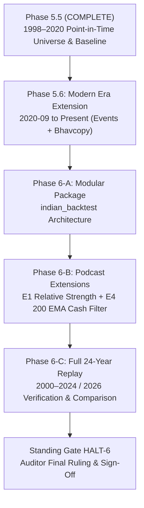

# PHASE 5.6 & PHASE 6 BUILD DIRECTIVE: MODERN ERA EXTENSION & MODULAR PODCAST BACKTESTER

**Document**: `deliverables/gate_ef/NEXT_TASK.md`  
**From**: Auditor & Instructor  
**To**: Builder Team  
**Date**: September 25, 2026  
**Status**: ACTIVE DIRECTIVE  
**Prerequisite**: Phase 5.5 Complete & Accepted (Standing Gate HALT-5 CLEARED)

---

## 1. Executive Context & Transition

Phase 5.5 has been formally **ACCEPTED** with zero discrepancies across all 6 gates:
- **Gates A & B**: Joint Bhavcopy coverage verified (median 87.03% $\ge 85\%$), 22-year event log continuity verified (0 orphans, 0 duplicates, counts strictly in $[500, 501]$).
- **Gates C & D**: 7 broad market indices audited, universe turnover across 4.7 years quantified (32.67%), and survivorship bias rigorously isolated (Run a survivor 16.62% vs Run b point-in-time 12.92%, delta -3.70 pp).
- **Gates E & F**: Bi-directional round-trip replay equivalence mathematically verified across 3 historical tiers (symmetric difference == 0), end-boundary continuity verified, 100% byte-identical reproducibility verified (`6b473ca5...`), and out-of-bounds date clamping to `2020-09-14` strictly confirmed.

We now enter the final phases required to deliver the production-grade rule-based momentum backtester as articulated in the podcast *"Paise Stock Se Nahi, Momentum Se Bante Hain: Rule Based Investing"*.

---

## 2. Roadmap: Two Final Delivery Milestones



---

## 3. Phase 5.6: Modern Era Extension (2020-09 to Present)

### Objective
Extend point-in-time universe membership and Bhavcopy daily price bars from `2020-09-14` through the modern era (2024–2026).

### Tasks:
1. **Index Event Ingestion (2020-09 to Present)**:
   - Ingest semi-annual index rebalancing bulletins (NSE / NiftyIndices circulars for March and September reviews) from 2020-09 through 2026.
   - Maintain the append-only contract in `data/index_events_modern.parquet` (or append to `index_events.parquet` with explicit source metadata).
   - Resolve any modern corporate ticker renames, mergers, and demergers in `data/symbol_map.parquet`.
2. **Modern Bhavcopy Ingestion**:
   - Ingest daily adjusted Bhavcopy bars from 2020-09 through current date into `adjusted_bhavcopy_bars_modern.parquet`.
   - Maintain corporate action adjustments (splits, bonuses, rights).
3. **Continuity & Coverage Verification (Gate 5.6-A)**:
   - Verify step-transition from `2020-09-14` into the modern era.
   - Assert point-in-time joint Bhavcopy coverage remains $\ge 85\%$ across all modern rebalance snapshots.

---

## 4. Phase 6: Modular Backtester Architecture (`indian_backtest`) & Podcast Strategy

### Objective
Implement the production-grade, modular Python backtesting framework `indian_backtest` that replicates the podcast momentum strategy and verifies its multi-cycle performance.

### Architecture Requirements (`indian_backtest/`):
```
indian_backtest/
├── __init__.py
├── data/
│   ├── bhavcopy_reader.py      # Fast parquet reader for adjusted daily bars
│   ├── universe_manager.py     # Point-in-time constituent resolver across 1998–2026
│   └── calendar_manager.py     # NSE trading calendar & monthly rebalance scheduler
├── indicators/
│   ├── moving_averages.py      # EMA 200, SMA calculations
│   ├── price_extremes.py       # 252-day high / low channels
│   └── relative_strength.py    # E1: RS ratio of stock vs NIFTY500 benchmark
├── engine/
│   ├── portfolio.py            # Portfolio state, cash, share holdings, accounting
│   ├── rebalancer.py           # Ranking, selection, equal-weight allocation, exit rules
│   ├── execution.py            # Next-Day Open execution with slippage/costs
│   └── regime_filter.py        # E4: Market regime 200 EMA cash filter
└── analytics/
    ├── metrics.py              # CAGR, Max DD, Sharpe, Sortino, Win Rate, Profit Factor
    ├── tearsheet.py            # Performance breakdown, multi-cycle drawdowns
    └── auditor_assert.py       # Automated Rule R-3 accounting identity validator
```

### Strategy Rule Specification (Podcast Implementation):
1. **Universe**: NIFTY 500 point-in-time constituents (zero survivorship bias).
2. **Ranking & Selection**:
   - Rule R2: $Close \ge 0.80 \times \text{High}_{252}$ (within 20% of 52-week high).
   - Rule R3: $Close > \text{EMA}_{200}$ (above 200-day exponential moving average).
   - **Extension E1 (Relative Strength)**: Rank surviving candidates by Relative Strength (RS) ratio vs NIFTY 500 index over 12 months. Top $N=20$ scrips selected.
3. **Portfolio Construction & Maintenance**:
   - Equal weight allocation across open slots at entry.
   - Retained winning positions are not rebalanced (let winners run).
   - Exit rank: $2 \times N = 40$ (stock exits when RS ranking falls below 40).
   - Trend stop: Stock exits immediately if $Close < 0.80 \times \text{High}_{252}$ or $Close \le \text{EMA}_{200}$.
4. **Extension E4 (Market Regime Cash Filter — Podcast Core)**:
   - When NIFTY 500 benchmark index closes below its own 200 EMA on rebalance day:
     - No new positions are initiated.
     - Existing cash remains in cash (or risk-off allocation).
     - Protects capital during major bear markets (e.g. 2008 GFC, March 2020 COVID crash).
5. **Friction & Transaction Costs**:
   - Include realistic slippage (10 bps) and statutory STT/turnover charges.
6. **Standing Rules Honored**:
   - **Rule R-3**: Accounting identity residual strictly $0.00$ ($\text{abs} < 10^{-6}$).
   - **Rule R-6**: Byte-identical dual-pass reproducibility across all backtest runs.

---

## 5. Required Deliverables for Next Review

The builder must submit:
1. `deliverables/phase_5_6/`: Modern era event and price coverage verification, continuous transition across 2020-09-14.
2. `deliverables/phase_6/`:
   - Production code package `indian_backtest/`.
   - Comparative backtest reports across full multi-cycle period (2000–2024 / 2026):
     * Baseline Momentum (without RS/Regime)
     * Momentum + E1 RS Ranking
     * Full Strategy: Momentum + E1 RS + E4 Market Regime 200 EMA Cash Filter
   - Attribution & Drawdown analysis verifying whether the strategy matches the podcast benchmark (~29.6% CAGR vs ~14.8% NIFTY500 TR with controlled drawdowns).
   - Dual-pass reproducibility verification logs and SHA-256 digests.
3. Standing Gate **HALT-6** left unticked and open awaiting formal Auditor review.

---
*Directive issued by Project MIP Auditor & Governance System.*
